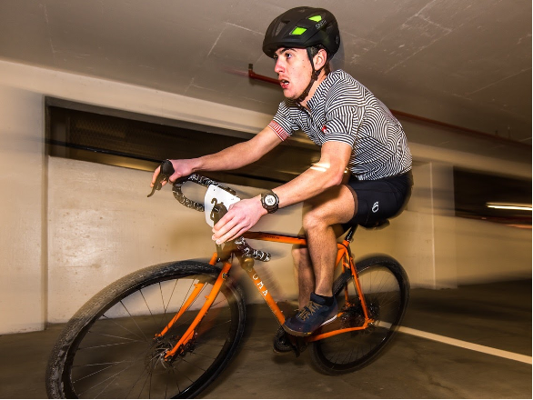

# About Me

## Hi - I'm Mr. Jones
:::{class="image-row"}
:::{class="image-column"}
:::{.element: class="fragment fade-in"}

:::

:::{.element: class="fragment fade-in"}


:::
:::
:::{class="image-column"}
:::{.element: class="fragment fade-in"}

:::
:::{.element: class="fragment fade-in"}

:::
:::
:::{class="image-column"}
:::{.element: class="fragment fade-in"}

:::
:::{.element: class="fragment fade-in"}

:::
:::
:::

# My Computer Science Journey

## Overview
:::{class="mermaid"}
```{=html}
timeline
    title My Computer Science Journey
    2008 : Took AP CS A
    2009 : Started my CS Major at UVA
    2010 : First internship - Java
    2012 : Second internship - Databases at NASA
    2013 : Graduated UVA, started my first job
    2021 : Masters Degree - Systems Engineering at Virginia Tech
    2022 : Started teaching at Wakefield
```
:::

## 2008(?) - I took AP Computer Science A 
- I just took it for the AP credit
- I had no programming experience before this
- I loved it!

## 2009 : Started my CS Major at UVA
- I loved UVA

## 2010 : First internship - Java

## 2012 : Second internship - Databases at NASA

## 2013 : Graduated UVA, started my first job

## 2021 : Masters Degree - Systems Engineering at Virginia Tech

## 2022 : Started teaching at Wakefield
