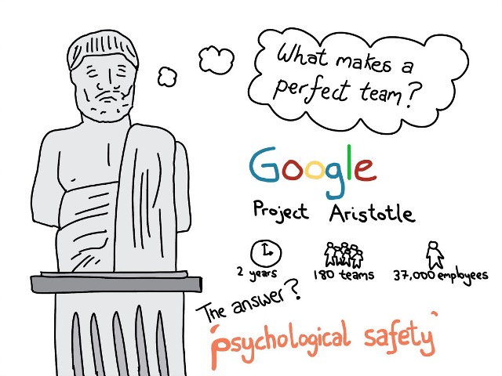
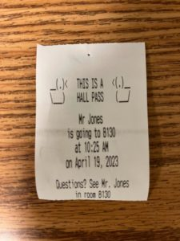

# First, some basic agreements

## Things I believe
- Computer programming is super fun!
- The world needs more computer programmers
    - You don’t have to become a computer programmer - Everyone would benefit from understanding computer programming
- EVERYONE can be good at computer programming
    - You don’t need to be great at math, science, or any other subject to be a great computer programmer
- EVERYONE can succeed in this class
    - And if you succeed in this class, you will become a good computer programmer
- If you don’t understand something in this class, it’s probably my fault, not yours

## Our Goal: Be a great software team
- Google's "Project Aristotle"
- One goal - answer the question "What makes a perfect team"
- Spent two years, interviewed 37,000 employees
- What do you think they learned?

## Psychological Safety

## Related Note - we need a class charter

## My Goals
1. Safety
2. Teach Computer Programming
3. Teach Workplace Skills
4. Have Fun!
5. Assign Grades and Assess Competencies

## Workplace Readiness
A requirement of this course

We'll talk about jobs, learn how to make resumes, etc

Practice professional communication (I'm not your "bruh")

# Class Expectations

## Put your phones away
- Computers and headphones too
- During instruction, I have no patience for this
- All work is group work, so no headphones/music
- But I'll play music, and suggestions are welcome!

## Leaving class

# Welcome to college! Academic expectations

## Dual Enrollment
- You are taking two classes at the same time
- You get academic credit from BOTH APS and NOVA for this class
- At the same time, you have to satisfy expectations for both
- This is a big commitment! Today you'll sign a "Dual Enrollment Contract"

## A few specific things to know
- No Retakes
- No Late Work
- Different grades
- Different accommodation rules

## "Flipped" Classroom
- You should learn the material on your own
- Class time is not for lecturing, it's for practicing
- Reading assignments every day, reading quizzes at the beginning of every class

## Let me know if you need help!
- I try to talk one-on-one with every student every day
- You get support from APS and NOVA

# Grading - Web Design

## First - what does a grade mean?
"An inadequate report of an inaccurate judgment by a biased and variable judge of the extent to which a student has attained an undefined level of mastery of an unknown proportion of an indefinite material" 

- Paul Dressel (1983)

## Formative vs Summative
- Formative: assessment **for** learning
    - eg. most classwork, warmups, exit tickets
- Summative: assessment **of** learning
    - eg. tests, projects

## Pop quiz - formative or summative?
- This pop quiz
- A warmup quiz
- A daily classwork coding assignment
- An end-of-unit multiple choice test
- A 2-week project

## Your grade is almost entirely Summative!
- 20% of quarter grades: We'll have formative quizzes most days, and coding practice in class
- 80% of quarter grades: Most of your grade will come from tests, projects
- 20% of semester grade: final exam
- I will make this clear throughout the year

## Summary: Grade Breakdown
- Quarter Grade: 20% formative, 80% summative
- Semester Grade: 40% Q1, 40% Q2, 20% Exam (same for Q3&4)
- Final Grade for the year: 50% Semester 1, 50% Semester 2

## Points system
- I'll weight different assignments differently
- I'll explain more about this as the year goes on

# Grading - Databases

## I intend to approach this course like a seminar
- Intention/Expectation: Everyone who does the reading, shows up, participates gets an A
- I'll follow Jeff Elkner's grading strategy
- Midterm/Final exam TBD

# Some more about this class

## Tons of resources
- I don't like to reinvent things, so we'll use a lot of these resources
- But I also don't have a single website I love, so we'll bounce around a lot



